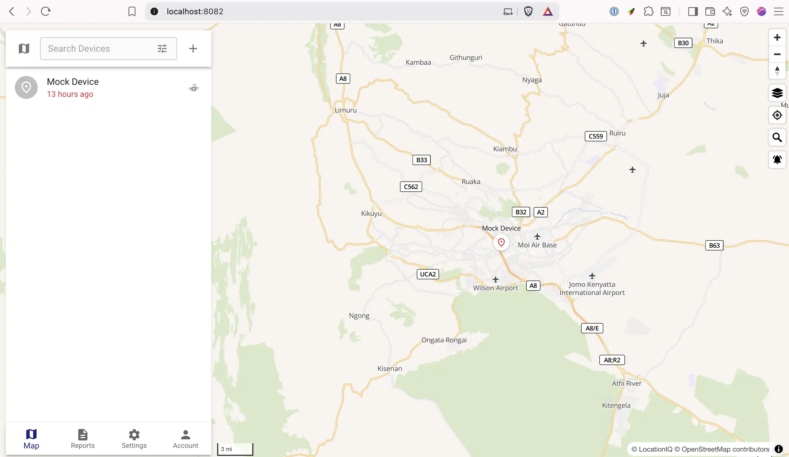

# TrackTelemetry Traccar PHP SDK

[](https://packagist.org/packages/tracktelemetry/laravel-traccar)

[](https://packagist.org/packages/NjoguAmos/laravel-traccar)



**Track Telemetry Laravel Traccar** is a Laravel specific composer package that simplifies integration with the Traccar GPS tracking platform. It provides an elegant, expressive API to interact with Traccar’s REST endpoints.


## Requirements

| Version | PHP    | Composer | Laravel |
|---------|--------|----------|---------|
| 1.x     | >= 8.4 | Required | >= 11.x |

## Installation

You can install the package via Composer

```
composer require tracktelemetry/traccar
```

## Configuration

### Environment variables
- `TRACCAR_API_KEY` – Your Traccar API token
- `TRACCAR_BASE_URL` – Base API URL (default `https://demo.traccar.org/api`)


## Configuration

You can publish the configuration by running the following command:

```bash
php artisan vendor:publish --tag=config --provider="TrackTelemetry\\Traccar\\TraccarServiceProvider"
```

# Usage

Here is a quick example of how to get server information.

```php
use TrackTelemetry\Traccar\Facades\Traccar;

// returns TrackTelemetry\Traccar\Dto\ServerData
$info = Server::getInformation(); 

$version = $info->version; // '6.10'
$speedUnit = $info->attributes->speedUnit->value; // 'kn', 'kmh', or 'mph'
$timezone = $info->attributes->timezone; // e.g. 'UTC'
````

## Full Documentation
The full documentation can be found [on Track Telemetry Website](https://traccar.tracktelemetry.com/).

## Testing

```bash
composer test
```

## Changelog

Please see [CHANGELOG](CHANGELOG.md) for more information on what has changed recently.

## Contributing

Please see [Contribution Guidelines](https://github.com/tracktelemetry/.github/blob/main/CONTRIBUTING.md) for details.

## Security Vulnerabilities

Please review [our security policy](../../security/policy) on how to report security vulnerabilities.

## Credits

- [Njogu Amos](https://github.com/njoguamos)
- [All Contributors](../../contributors)

## License

The MIT License (MIT). Please see [License File](LICENSE.md) for more information.
