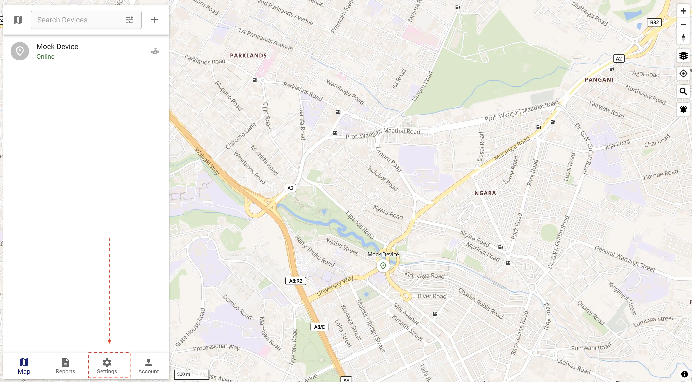
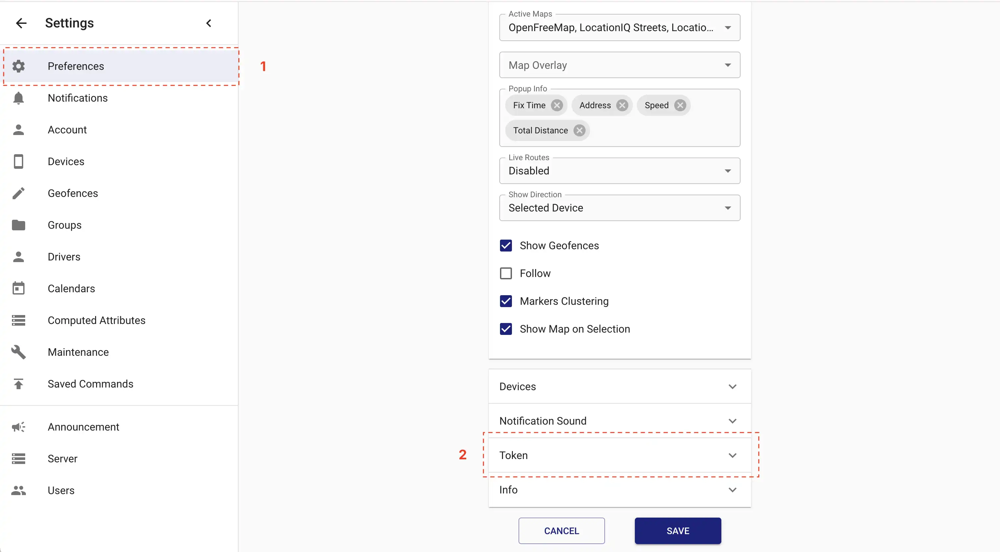
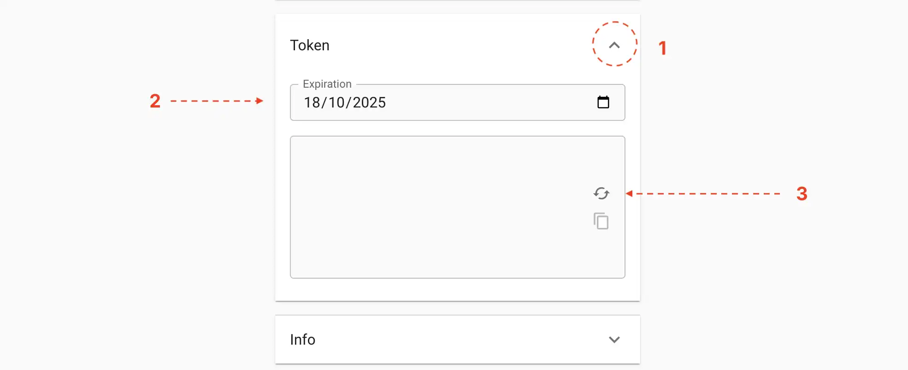
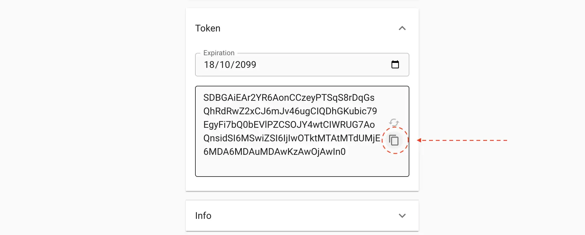

# How to Generate Traccar Bearer Token

To authenticate and authorize access to Traccar's API, you need to generate a bearer token. This token is used for secure communication between your application and the Traccar server.

There are two ways to generate a bearer token: From UI or from CLI.

## 1. Generating from UI

Login into your Traccar account and navigate **settings** 




Select **preferences** and navigate to **token** section on right



Expand the **token section**, set an **expiration date** and click **refresh icon** to generate a new token.



Copy the generated token and use it in your application.



```dotenv
TRACCAR_BASE_URL=http://host.docker.internal:8082/api
TRACCAR_API_KEY=your-copied-token-here
```

## 2. Generating from CLI

You can use the following bash script to generate a bearer token.

```shell
# Replace the values with your own.
BASE_URL="http://localhost:8082"
USERNAME="user@example.com"
PASSWORD="password"
EXPIRATION="2050-10-11T00:00:00Z"

curl -v -u "${USERNAME}:${PASSWORD}" \
  -H "Content-Type: application/x-www-form-urlencoded" \
  -X POST "${BASE_URL}/api/session/token" \
  -d "expiration=${EXPIRATION}"
```

The results will be a plain text token.

```shell
RjBEAiBbgi9NsUCPrVBr17SkmZr....MDowMCJ9% 
```

> [!TIP]
> We plan to create a laravel artisan command in the future to help you generate a bearer token.
