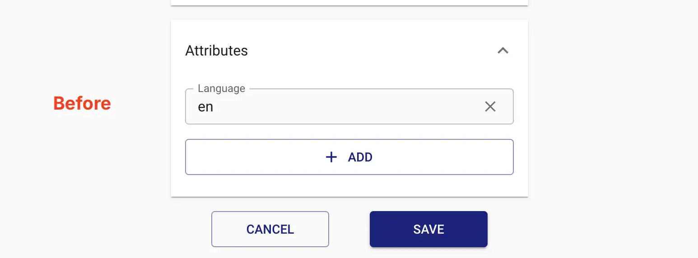
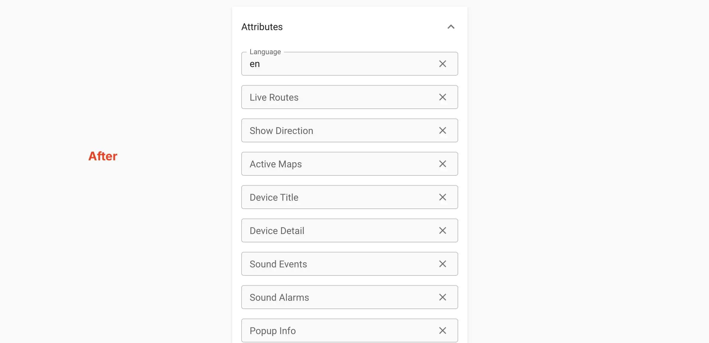

# Update Server Information

Update your Traccar server instance information.

> [!IMPORTANT]
> This endpoint is restricted to admin users only on the Traccar server.

## Request

To update Traccar server information, follow the steps below.

#### 1. Get the current server information.

```php
$data = \ThingsTelemetry\Traccar\Facades\Server::getInformation();
```

#### 2. Update the new DTO as needed.

```php
$data->map = \ThingsTelemetry\Traccar\Enums\Map::LOCATION_IQ_DARK;
$data->attributes->speedUnit = \ThingsTelemetry\Traccar\Enums\SpeedUnit::KILOMETERS_PER_HOUR;
```
> [!IMPORTANT]
> Only update the fields you want to change.

#### 3. Send the updated DTO to the server  method.

```php
$response = \ThingsTelemetry\Traccar\Facades\Server::updateInformation($data);
```

## Full Example

```php
// Get the current server information
$data = \ThingsTelemetry\Traccar\Facades\Server::updateInformation();

// Updated
$data->map = \ThingsTelemetry\Traccar\Enums\Map::LOCATION_IQ_DARK;
$data->attributes->speedUnit = \ThingsTelemetry\Traccar\Enums\SpeedUnit::KILOMETERS_PER_HOUR;
$data->attributes->speedUnit = \ThingsTelemetry\Traccar\Enums\SpeedUnit::MILES_PER_HOUR;
$data->attributes->distanceUnit = \ThingsTelemetry\Traccar\Enums\DistanceUnit::MILES;
$data->attributes->altitudeUnit = \ThingsTelemetry\Traccar\Enums\AltitudeUnit::FEET; 
$data->attributes->volumeUnit = \ThingsTelemetry\Traccar\Enums\VolumeUnit::LITERS; 
$data->coordinateFormat = \ThingsTelemetry\Traccar\Enums\CoordinateFormat::DDM;
$data->announcement = 'Planned maintenance on Saturday 02:00 UTC';
$data->attributes->timezone = 'Africa/Nairobi';
$data->fixedEmail = false;
$data->bingKey = 'your-bing-key';

// Send
$response = \ThingsTelemetry\Traccar\Facades\Server::updateInformation($data);
```

> [!IMPORTANT]
> This process preserves unknown/forward-compatible attributes and avoids accidentally resetting fields you didn’t intend to change.

## Results

The response is an instance of `ThingsTelemetry\Traccar\Dto\ServerData` DTO class

```php
$version = $info->version; // "6.10"
$mapProvider = $info->map->label(); // "Google Satellite"
$speedUnitValue = $info->attributes->speedUnit->value; // "kmh"
$speedUnitLabel = $info->attributes->speedUnit->label(); // "Kilometers per Hour (km/h)"
$timezone = $info->attributes->timezone; // "Africa/Nairobi"
```

## Traccar UI Side Effect

When `updateInformation` is called, some configuration values are updated to default `null` or `false` values. 

### Before: Null & False Attributes Hidden


### After: Null & False Attributes Visible


This caused them to show up on Traccar UI. This however, does not affect the actual server configuration.

## Important Links
- [Traccar Fetch Server information Documentation](https://www.traccar.org/api-reference/#tag/Server/paths/~1server/put)
- [ServerData DTO documentation](./../reference/dto/server-data)